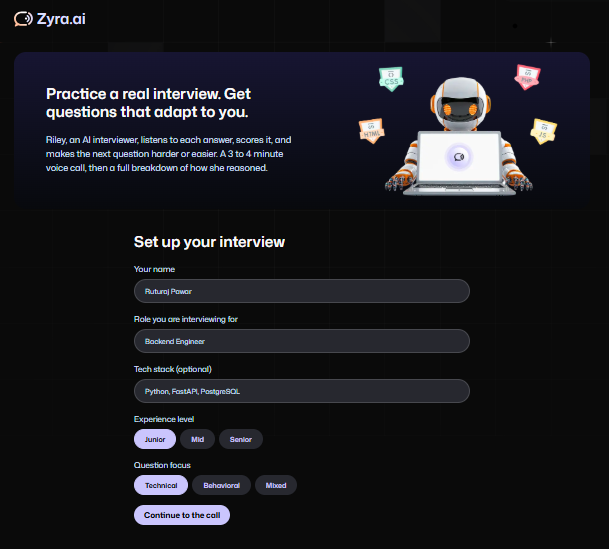
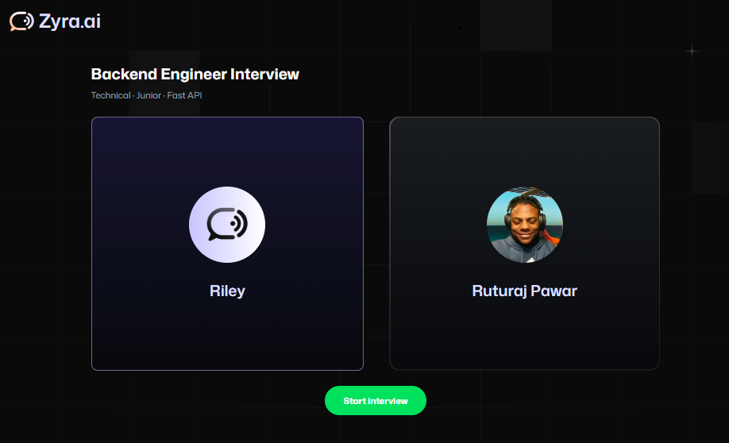
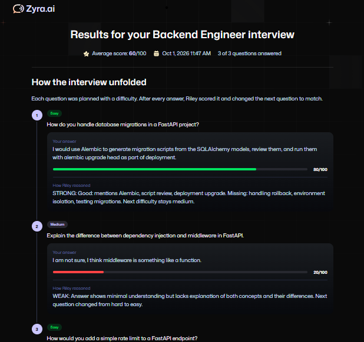
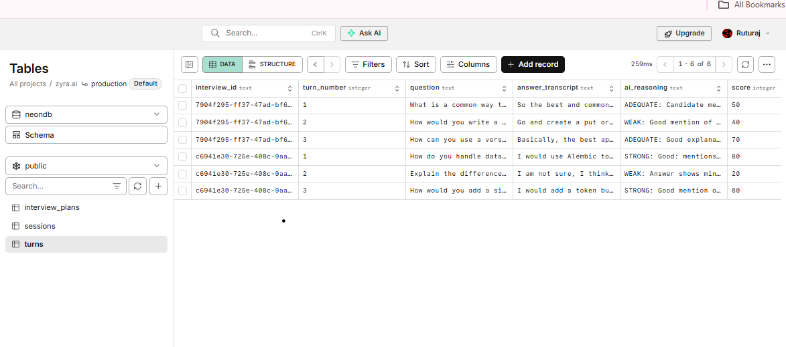
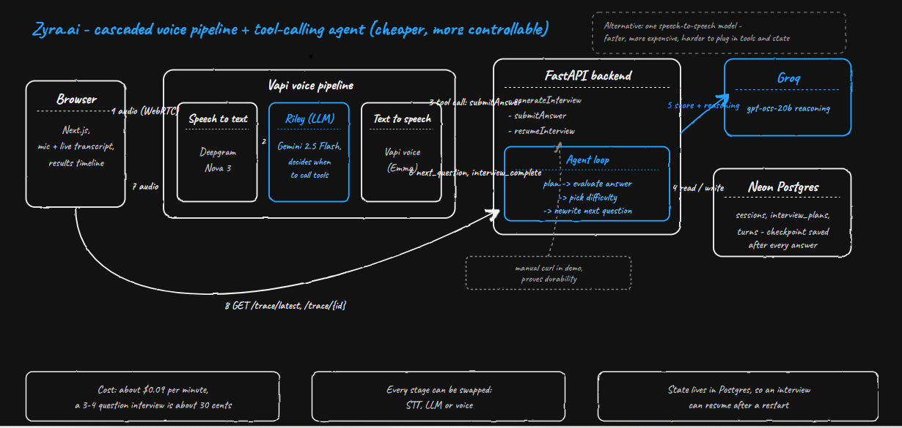

# Zyra.ai

**An agentic AI voice interviewer for students who can't afford a human mock interview.**

Riley conducts a short voice interview (3 to 4 questions, about 3 to 4 minutes), scores every answer, and rewrites the next question to be harder or easier depending on how the candidate did. Every decision is saved, so the full reasoning can be replayed as a timeline and an interrupted interview can be resumed.

Built for **BHARAT AGENTIC 2026** (aiKart) | Domain: EdTech & Future Skills

| | |
| --- | --- |
| Live app | `<NETLIFY_URL>` |
| Live API | `<RENDER_URL>/docs` |
| Demo video | `<VIDEO_URL>` |

## The problem

Students outside the big metros rarely get realistic interview practice. Human mock interviewers are expensive and hard to schedule, and most free tools are static question lists with no feedback and no adaptation. Candidates walk into their first real interview never having been challenged or scored.

## What Zyra does

1. The candidate enters a role, level and tech stack, then starts a voice call.
2. Riley plans the interview and asks the first question by voice.
3. After every answer, the agent scores it and reasons about what to ask next.
4. Strong answer: the next question gets harder. Weak answer: it gets easier.
5. When the call ends, the candidate sees a timeline: each question, their answer, a score, and how Riley reasoned.

<p>
  
  
</p>
<p>
  
  
</p>

## Why it is agentic (not a wrapper)

| Step | What happens |
| --- | --- |
| Plan | `generateInterview` plans 3 to 4 questions with escalating difficulty and saves the plan |
| Observe and reason | `submitAnswer` scores each answer with an LLM and decides the next difficulty |
| Replan | The next question is rewritten when the difficulty changes, and the plan is updated |
| Act and persist | Turn, score, reasoning and checkpoint are written to Postgres |
| Recover | `resumeInterview` restores an interview from its checkpoint, even after a server restart |

Design choices that make it reliable on a live call:

- **The database is the source of truth.** If the voice model sends a wrong question number, the server ignores it and uses the saved checkpoint.
- **Idempotent tool calls.** A retried or duplicated call (row lock plus existing-turn check) never double-counts an answer.
- **Safe fallbacks.** If the LLM times out, the agent falls back to template questions and a neutral score, so a call never dies mid-interview.
- **Cost control.** The interview is deliberately capped at 3 to 4 questions to keep voice minutes low.

## Architecture



```
Browser (Next.js)  --voice-->  Vapi assistant "Riley"
       |                              |  custom tools (HTTP POST)
       |                              v
       +------ GET /trace ------>  FastAPI  --->  Groq (openai/gpt-oss-20b)
                                      |
                                      v
                                 Neon Postgres: sessions, interview_plans, turns
```

| Route | Purpose |
| --- | --- |
| `POST /tools/generate-interview` | Vapi tool: plan and save the interview, return the first question |
| `POST /tools/submit-answer` | Vapi tool: score the answer, adapt, return the next question or completion |
| `POST /tools/resume-interview` | Restore checkpoint, history and next question (demonstrated via curl or Postman) |
| `GET /trace/{interview_id}` | Plan, turns, scores and AI reasoning for the timeline UI |

Vapi tool definitions live in [`vapi/`](vapi/). There is no login: a candidate is a name plus a random id kept in the browser.

## Bharat impact

- **Access:** a student in a tier-2 or tier-3 town needs only a browser and a mic.
- **Cost:** a 4-minute session runs at roughly $0.09 per minute in voice cost, about $0.36 or around Rs 30 (our estimate from Vapi's dashboard, excluding hosting). Human mock interviews are typically priced in the hundreds to thousands of rupees per session (indicative; varies by provider).
- **Adaptive practice:** difficulty follows the candidate, instead of a fixed question bank.
- **Transparent feedback:** scores come with the reasoning behind them, so students know what to fix.

## Tech stack

Next.js 16, Tailwind, Vapi (voice), FastAPI, Neon Postgres, Groq (`openai/gpt-oss-20b`). Hosted on Render (API) and Netlify (frontend).

## Run locally

Backend:

```
cd backend
python -m venv .venv && .venv\Scripts\activate
pip install -r requirements.txt
copy .env.example .env      (fill in DATABASE_URL and GROQ_API_KEY)
uvicorn app.main:app --reload --port 8000
```

Frontend:

```
cd frontend
npm install
copy .env.local.example .env.local      (fill in the values)
npm run dev
```

Vapi calls your backend over HTTPS, so for a local voice call expose port 8000 with a tunnel such as ngrok and point the tool URLs at it. Backend env: `DATABASE_URL`, `GROQ_API_KEY`, `GROQ_MODEL`, `FRONTEND_ORIGIN` (comma-separated), `MAX_QUESTIONS`. Frontend env: `NEXT_PUBLIC_API_URL`, `NEXT_PUBLIC_VAPI_WEB_TOKEN`, `NEXT_PUBLIC_VAPI_ASSISTANT_ID`. No secrets are committed.

## Disclosure of pre-existing work

The visual shell of the frontend (layout, theme, call screen and avatar assets) is reused from an earlier personal project, a Next.js and Firebase mock interview app. For this hackathon all Firebase and login code was removed, and the entire FastAPI backend, the database schema, the Vapi tools, the agent reasoning loop, the Riley assistant prompt and the results timeline were built during the 12-hour window.